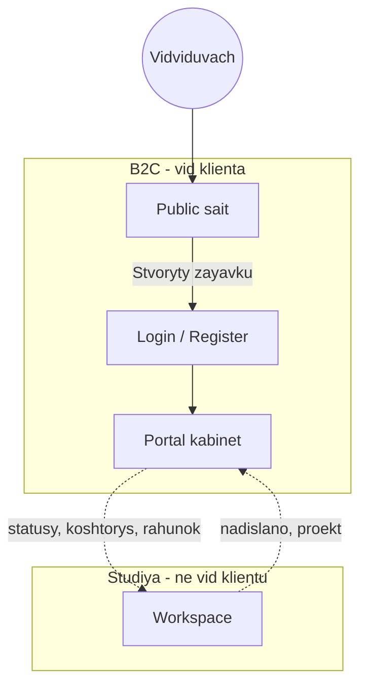
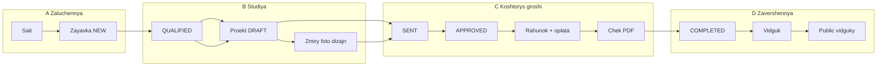
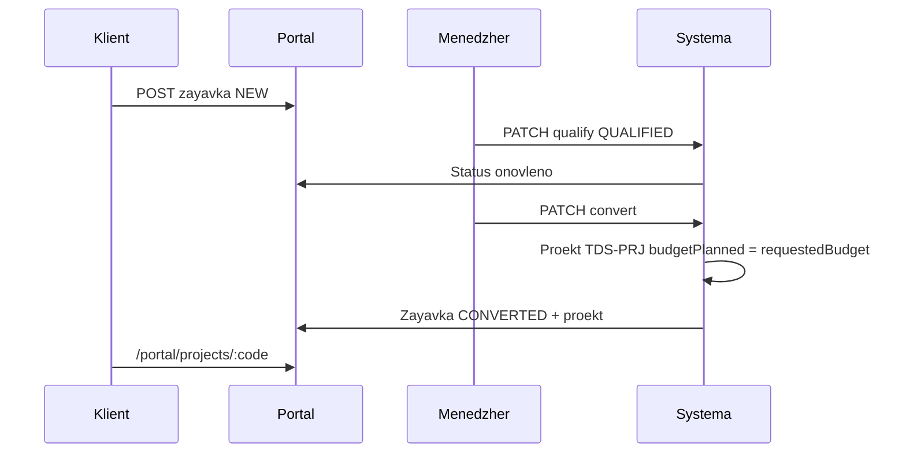
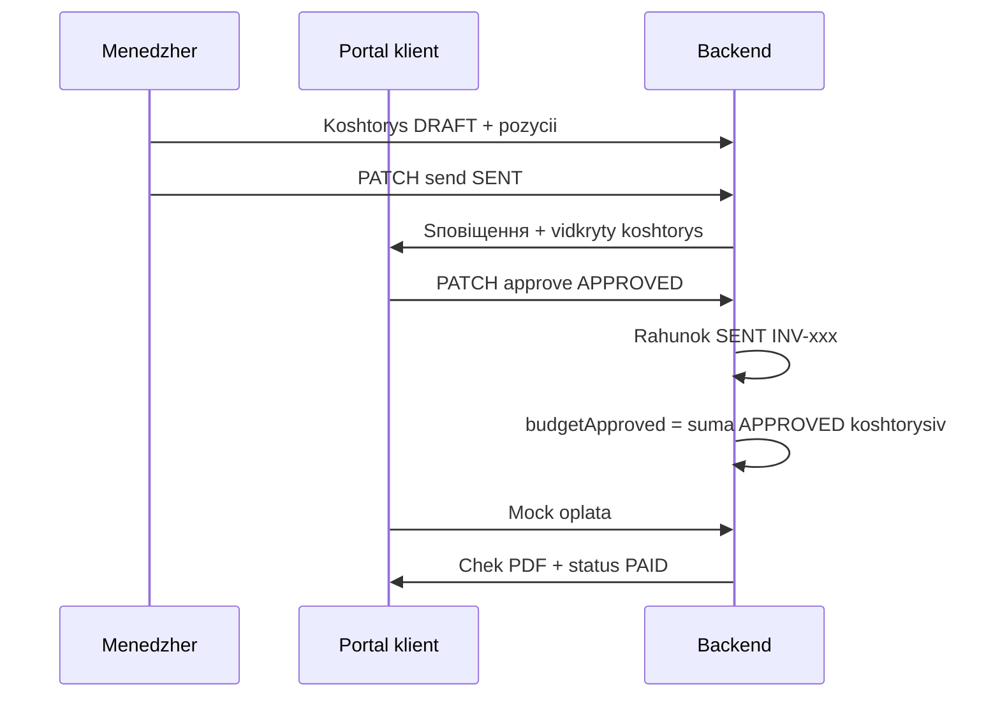

# B2C-флоу (бізнес → клієнт) — технічний опис

> **Для нетехнічного читача** (хто що робить крок за кроком): **[E2E_FLOW_UK.md](E2E_FLOW_UK.md)**.

Документація описує **повний шлях клієнта** у INTERIORIX: від першого візиту на сайт до оплати, чека та відгуку. **B2C** (інколи в листуванні «К2К») — взаємодія **студії з кінцевим замовником** через публічний сайт і **клієнтський портал** (`/portal/...`).

**Пов’язані матеріали:**

- [E2E: хто що робить](E2E_FLOW_UK.md) — для менеджерів, тестувальників, клієнтів  
- [Інструкція для тестування](TESTING_GUIDE_UK.md) — покрокові кліки та демо-логіни  
- [Бізнес-логіка (диплом)](../help/01-biznes-logika.md) — ролі, статуси, альтернативи  
- [Сторінки та контури](../help/02-storinky-ta-kontury.md) — URL порталу та workspace  

---

## 1. Мета B2C-флоу

| Ціль | Як досягається |
|------|----------------|
| Залучити клієнта | Публічний сайт: послуги, портфоліо, відгуки |
| Прийняти запит | Заявка з порталу → CRM студії |
| Прозорість | Клієнт бачить статус заявки, проєкт, кошторис, оплату |
| Юридично-фінансовий слід | Рахунок після погодження кошторису, чек після оплати (демо) |
| Репутація | Відгук після завершення проєкту, модерація, публікація на сайті |

---

## 2. Учасники та зони системи

| Учасник | Зона | URL |
|---------|------|-----|
| Відвідувач | Public | `/`, `/services`, `/portfolio`, … |
| Клієнт (авторизований) | Portal | `/portal/...` |
| Менеджер, дизайнер, бригадир | Workspace | `/workspace/...` (клієнт **не** має доступу) |

---

## 3. Загальна схема B2C (життєвий цикл)

**Ключові коди:**

| Етап | Сутність | Приклад коду |
|------|----------|--------------|
| Заявка | Order | `TDS-LEAD-37470094` |
| Проєкт | Project | `TDS-PRJ-20` |
| Рахунок | Invoice | `TDS-PRJ-20-INV-001` |
| Чек | Receipt | `RCPT-2026-…` |

---

## 4. Фаза A — залучення та заявка (клієнт)

### 4.1. Публічний сайт (без входу)

| Крок | Дія клієнта | Сторінка |
|------|-------------|----------|
| 1 | Ознайомлення зі студією | `/` |
| 2 | Вибір послуги | `/services`, `/services/:slug` |
| 3 | Референс з портфоліо (опційно) | `/portfolio/:slug` → «Подібний проєкт» |
| 4 | Перехід до заявки | Кнопка **Створити заявку** → `/login?next=...` |

### 4.2. Вхід і реєстрація

- **Вхід:** `/login` (роль `CLIENT` → редірект у `/portal/dashboard`).  
- **Реєстрація:** `/register` — створення облікового запису клієнта.  
- На сторінці входу в демо доступні швидкі підстановки email (напр. `client@tailored.demo`).

### 4.3. Нова заявка

**URL:** `/portal/orders/new`

| Поле | Обов’язковість | Призначення |
|------|----------------|-------------|
| Послуга (каталог) | Так | Прив’язка до `serviceSlug` |
| Назва, опис | Так | Суть запиту |
| Місто, адреса, телефон | Так | Об’єкт і контакт |
| Бюджет | Ні | Потрапляє в проєкт як **«бюджет від клієнта (заявка)»** |
| Стиль, бажана дата старту | Ні | Додатковий контекст |
| Референс-фото / портфоліо | Ні | Візуальні побажання |

**API:** `POST /portal/orders` (авторизований клієнт).

**Результат:**

- Код заявки `TDS-LEAD-…`  
- Статус **`NEW`** («Нова»)  
- Редірект на `/portal/orders/:code`  
- Сповіщення менеджеру в workspace  

### 4.4. Що бачить клієнт після подачі

| Місце | Зміст |
|-------|--------|
| `/portal/orders` | Список заявок і статусів |
| `/portal/orders/:code` | Деталі, таймлайн, скасування (поки `NEW` або `QUALIFIED`) |
| `/portal/dashboard` | Зведення «потрібна увага» / «в роботі» |

**Тексти статусів для клієнта** (орієнтовно):

| Статус | Повідомлення в порталі |
|--------|-------------------------|
| `NEW` | Надіслано — очікує на розгляд |
| `QUALIFIED` | Команда опрацьовує вашу заявку |
| `CONVERTED` | Перетворено на активний проєкт |
| `REJECTED` | Заявку закрито |

---

## 5. Фаза B — від заявки до проєкту (студія → відображення в порталі)

Ці кроки виконує **менеджер** у `/workspace/orders`. Клієнт лише **бачить оновлення статусів** і посилання на проєкт.

| Крок | Дія студії | Статус заявки | Що з’являється у клієнта |
|------|------------|---------------|---------------------------|
| 1 | Кваліфікація | `QUALIFIED` | Статус «опрацьовується» |
| 2 | Конвертація в проєкт | `CONVERTED` | Проєкт у `/portal/projects`, код `TDS-PRJ-…` |
| 3 | Призначення команди | — | На огляді проєкту: менеджер, дизайнер |
| 4 | Заміри, дизайн-файли, фото з об’єкта | — | Вкладка **Фото** (дві секції) |

**При конвертації:**

- `budgetPlanned` проєкту = `requestedBudget` з заявки (або `0`, якщо не вказано).  
- Рахунок **ще не** створюється.  

**Опційно:** дизайнер **закріплює** заявку (`POST /crm/orders/:code/claim`) до конвертації.

### 5.1. Статуси проєкту (що означають для клієнта)

Клієнт бачить **спрощений** статус на дашборді; у картці проєкту — етап студії.

| Код | Назва | Для клієнта (зміст) |
|-----|-------|---------------------|
| `DRAFT` | Чернетка | Підготовка пропозиції |
| `ESTIMATION` | Кошторис | Готується розрахунок |
| `DESIGN` | Дизайн | Розробка рішень |
| `APPROVED` | Погоджено | Напрям / кошторис узгоджено |
| `IN_PROGRESS` | У роботі | Роботи на об’єкті |
| `PAUSED` | На паузі | Тимчасова зупинка |
| `COMPLETED` | Завершено | Можна залишити відгук |
| `WARRANTY` | Гарантія | Післязавершний період |
| `CANCELLED` | Скасовано | Проєкт закрито |

Перехід між етапами — у workspace; частина переходів вимагає **погодженого й оплаченого** кошторису (правила стан-машини на бекенді).

---

## 6. Фаза C — кошторис, погодження, оплата (ядро B2C)

### 6.1. Версії кошторису

| Версія | Назва в UI | Призначення |
|--------|------------|-------------|
| v1 | **Основний кошторис** | Базова вартість проєкту |
| v2+ | **Додатковий кошторис** | Зміни, допрацювання, нові етапи |

Клієнт у порталі **не бачить** кошториси в статусах `DRAFT`, `PRICING`, `PENDING_REVIEW` — лише після **надсилання**:

`SENT`, `APPROVED`, `REJECTED`, `EXPIRED`.

### 6.2. Ланцюжок кошторис → гроші

| Крок | Хто | Дія | Статус кошторису / рахунку |
|------|-----|-----|---------------------------|
| 1 | Менеджер | Створює кошторис, позиції | `DRAFT` |
| 2 | Менеджер | **Надіслати клієнту** (з підтвердженням) | `SENT` |
| 3 | Клієнт | **Погодити** або **Запросити зміни** | `APPROVED` / `REJECTED` |
| 4 | Система | Після `APPROVED` — рахунок | Invoice `SENT` |
| 5 | Клієнт | **Оплатити** (демо) | Payment `PAID`, Invoice `PAID` |
| 6 | Система / менеджер | Чек PDF | Receipt `ISSUED` |

**Портал — проєкт:**

- Вкладка **Кошториси:** таблиця позицій, сума, кнопки погодження / оплати.  
- Вкладка **Оплати:** історія платежів і рахунків.  
- **Огляд:**  
  - **Бюджет від клієнта (заявка)** — з заявки;  
  - **Погоджений бюджет (сума кошторисів)** — сума всіх `APPROVED` кошторисів.

**Оплата:**

- З кошторису: кнопка **Оплатити** лише якщо `APPROVED` і рахунок `SENT` / `OVERDUE`.  
- Після `PAID` — бейдж **Оплачено**, повторна оплата недоступна.  
- URL оплати: `/portal/invoices/pay?invoiceId=...` або checkout з сумою.

**Публічна перевірка чека:** `/verify/:number` — без входу.

---

## 7. Фаза D — завершення та відгук

| Умова | Дія клієнта | Результат |
|-------|-------------|-----------|
| Проєкт `COMPLETED` | `/portal/reviews` — новий відгук | Статус «На модерації» |
| Менеджер / адмін | Модерація в workspace | Публікація на `/reviews` |

До завершення проєкту форма відгуку **недоступна**.

---

## 8. Клієнтський портал — карта екранів B2C

| Екран | URL | Етап B2C-флоу |
|-------|-----|----------------|
| Панель | `/portal/dashboard` | Увесь цикл, зведення |
| Нова заявка | `/portal/orders/new` | A |
| Мої заявки | `/portal/orders` | A, B |
| Деталі заявки | `/portal/orders/:code` | A, B |
| Мої проєкти | `/portal/projects` | B–D |
| Деталі проєкту | `/portal/projects/:code` | B–D (вкладки) |
| Рахунки | `/portal/invoices` | C |
| Оплата | `/portal/invoices/pay` | C |
| Чеки | `/portal/receipts` | C |
| Відгуки | `/portal/reviews` | D |
| Сповіщення | `/portal/notifications` | A–D |
| Профіль | `/portal/profile` | — |

### Вкладки проєкту (`/portal/projects/:code`)

| Вкладка | B2C-зміст |
|---------|-----------|
| Огляд | Статус, бюджети, команда, дати |
| Кошториси | Погодження, оплата |
| Фото | Дизайн-файли та фото з об’єкта (окремі блоки) |
| Оплати | Рахунки, платежі |
| Події | Журнал подій українською |

---

## 9. API (орієнтир для розробників)

Префікс порталу: `/portal/...` (JWT клієнта).

| Метод | Шлях | B2C-дія |
|-------|------|---------|
| `POST` | `/portal/orders` | Створити заявку |
| `GET` | `/portal/orders` | Список заявок |
| `GET` | `/portal/orders/:code` | Деталі заявки |
| `PATCH` | `/portal/orders/:code` | Оновити / скасувати (обмежено) |
| `GET` | `/portal/projects` | Список проєктів |
| `GET` | `/portal/projects/:code` | Деталі проєкту + кошториси (фільтр статусів) |
| `PATCH` | `/estimates/:id/approve` | Погодити кошторис |
| `PATCH` | `/estimates/:id/reject` | Запит на зміни |
| `GET` | `/portal/invoices` | Рахунки клієнта |

Кваліфікація та конвертація — **лише workspace:** `PATCH /crm/orders/:code/qualify`, `PATCH /crm/orders/:code/convert`.

---

## 10. Альтернативні B2C-сценарії

| Ситуація | Поведінка для клієнта |
|----------|------------------------|
| Заявку відхилено (`REJECTED`) | Проєкт не створюється; у порталі — «закрито» |
| Скасування заявки клієнтом | Поки `NEW` / `QUALIFIED` |
| Відхилений кошторис | Очікування нової версії від студії |
| Другий і наступні кошториси | Окреме погодження та оплата за версією |
| Проєкт на паузі | Статус у картці проєкту; роботи призупинені |

---

## 11. Сповіщення та прозорість

Події, які зазвичай потрапляють у **сповіщення** клієнта:

- Зміна статусу заявки  
- Кошторис надіслано / погоджено  
- Рахунок до оплати  
- Успішна оплата (демо)  

Центр сповіщень: `/portal/notifications`.

---

## 12. Обмеження демо-режиму

| Що | Демо | Продакшн (ціль) |
|----|------|------------------|
| Оплата | Mock-картка на `/portal/invoices/pay` | Платіжний шлюз (LiqPay, Stripe, …) |
| Підпис документів | Завантаження / перегляд | КЕП, Diia.Sign тощо |
| SMS / email | Сповіщення в UI | Зовнішні канали |

---

## 13. Короткий чеклист B2C (для приймання)

- [ ] Гість може дійти від послуги / портфоліо до заявки  
- [ ] Заявка створюється зі статусом `NEW` і кодом `TDS-LEAD-…`  
- [ ] Після конвертації клієнт бачить проєкт і **бюджет із заявки**  
- [ ] Клієнт не бачить чернеток кошторису  
- [ ] Після `SENT` — погодження та рахунок  
- [ ] **Погоджений бюджет** = сума всіх погоджених кошторисів  
- [ ] Оплата лише для `APPROVED` + рахунок `SENT`  
- [ ] Чек доступний і перевіряється на `/verify/…`  
- [ ] Відгук лише після `COMPLETED`  
- [ ] Фото: окремо дизайн і об’єкт, з датою на картці  

---

*Документ описує фактичну логіку репозиторію INTERIORIX (2026). При зміні API або UI оновлюйте цей файл разом із [TESTING_GUIDE_UK.md](TESTING_GUIDE_UK.md).*
