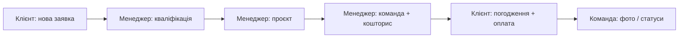

# Інструкція для тестування INTERIORIX

Документ для людини, яка **вперше** перевіряє систему: як запустити, де що натискати, які логіни використовувати і що має вийти на кожному кроці.

Хто що робить на кожному етапі (без техніки): [E2E_FLOW_UK.md](E2E_FLOW_UK.md).

---

## 1. Запуск системи

1. Переконайтеся, що встановлено **Docker Desktop** (Windows).
2. У папці проєкту двічі клікніть **`start.bat`**.
   - Скрипт сам спробує увімкнути Docker, зібрати контейнери, дочекатися API і заповнити демо-дані.
3. Дочекайтеся повідомлення **READY** у вікні.

**Адреси:**

| Що | URL |
|----|-----|
| Сайт і вхід | http://localhost:3000 |
| Вхід / реєстрація | http://localhost:3000/login |
| Кабінет клієнта | http://localhost:3000/portal/dashboard |
| Робочий простір команди | http://localhost:3000/workspace |
| API (для розробників) | http://localhost:4000 |
| Swagger | http://localhost:4000/api/docs |

**Зупинка:** `stop.bat` (зупиняє контейнери, Docker Desktop лишається увімкненим).

---

## 2. Демо-облікові записи

**Пароль для всіх акаунтів нижче:** `Demo12345!`

На сторінці входу можна швидко підставити email кнопками під формою.

| Роль | Email | Де працює |
|------|-------|-----------|
| Клієнт | `client@tailored.demo` | Кабінет `/portal/...` |
| Менеджер | `manager@tailored.demo` | Workspace `/workspace/...` |
| Дизайнер | `designer@tailored.demo` | Workspace (проєкти, заміри, «Мої задачі») |
| Бригадир | `brigadir@tailored.demo` | Workspace (задачі, фото з обʼєкта) |
| Адмін | `admin@tailored.demo` | Усе в workspace + користувачі |

Додаткові клієнти в seed: `client.hotel@tailored.demo`, `client.office@tailored.demo`, `client.retail@tailored.demo` (той самий пароль).

---

## 3. Головний сценарій (рекомендований)

Пройдіть **від заявки до оплати** — так перевіряється весь ланцюжок.

### Крок 1 — Клієнт подає заявку

1. Відкрийте http://localhost:3000/login  
2. Увійдіть як **`client@tailored.demo`** / `Demo12345!`  
3. Перейдіть: **Кабінет → Заявки** або напряму http://localhost:3000/portal/orders/new  
4. Заповніть форму:
   - оберіть **послугу** з каталогу (обовʼязково);
   - назва, опис, місто, адреса, телефон;
   - за бажанням — **бюджет** (це «бюджет від клієнта» у проєкті);
   - можна додати посилання на референс-фото або обрати проєкт з **портфоліо** на публічному сайті.
5. Натисніть надіслати заявку.

**Очікуваний результат:** редірект на сторінку заявки з кодом типу `TDS-ORD-...`, статус **«Нова»**. Заявка видна в списку `/portal/orders`.

---

### Крок 2 — Менеджер обробляє заявку

1. **Вийдіть** з кабінету клієнта (Профіль → Вихід) або відкрийте **приватне вікно** браузера.  
2. http://localhost:3000/login → **`manager@tailored.demo`**  
3. Меню зліва: **Заявки** → http://localhost:3000/workspace/orders  
4. Відкрийте **щойно створену** заявку (зверху списку або за кодом).

**Дії на картці заявки:**

| Кнопка | Коли доступна | Що робить |
|--------|----------------|-----------|
| **Кваліфікувати** | Статус «Нова» | Статус → **«Кваліфікована»** (клієнт бачить оновлення) |
| **Конвертувати в проєкт** | Після кваліфікації | Створює проєкт `TDS-PRJ-...`, заявка → **«Конвертована»** |
| **Відхилити** | Після кваліфікації | Закриває заявку без проєкту |

5. Натисніть **Кваліфікувати** → підтвердіть у вікні.  
6. Натисніть **Конвертувати в проєкт** → підтвердіть.  
7. Вас має перекинути на **сторінку проєкту**.

**Очікуваний результат:** у заявки зʼявляється посилання **«Проєкт TDS-PRJ-...»**, статус заявки **«Конвертована»**.

---

### Крок 3 — Менеджер призначає команду

На сторінці проєкту (`/workspace/projects/{id}`):

1. Блок **«Команда проєкту»** (менеджер / дизайнер / бригадир).  
2. Якщо є кнопка **«Редагувати команду»** — оберіть:
   - **Дизайнер:** напр. `designer@tailored.demo` або `art-director@tailored.demo` з seed;
   - **Бригадир:** `brigadir@tailored.demo`.
3. Збережіть.

**Очікуваний результат:** у картках команди зʼявляються імена та email. Клієнт на вкладці «Огляд» проєкту теж бачить менеджера й дизайнера.

**Опційно (дизайнер):** увійти як `designer@tailored.demo`, відкрити ту саму заявку (поки не конвертована) і натиснути **«Закріпити за собою»** — дизайнер привʼязується до ліда ще до проєкту.

---

### Крок 4 — Менеджер готує кошторис

На сторінці проєкту, секція **«Кошториси»**:

1. **«Новий кошторис»** (або «Додатковий кошторис», якщо вже є v1) — заповніть позиції, збережіть.  
2. Для кошторису в статусі **«Чернетка»**:
   - **«Надіслати клієнту»** — зʼявиться **попередження** (не системний alert); підтвердіть.
3. Статус кошторису → **«Надіслано клієнту»**.

**Очікуваний результат:** клієнт у `/portal/projects/{код}` → вкладка **«Кошториси»** бачить кошторис і кнопки **«Погодити»** / **«Запросити зміни»**. Чернетки клієнт **не** бачить.

Перевірте на проєкті **«Огляд»** (кабінет клієнта):

- **Бюджет від клієнта (заявка)** — сума з заявки;
- **Погоджений бюджет (сума кошторисів)** — сума всіх **погоджених** кошторисів (основний + додаткові).

---

### Крок 5 — Клієнт погоджує і оплачує

1. Увійдіть знову як **`client@tailored.demo`**.  
2. **Проєкти** → відкрийте свій проєкт → **Кошториси**.  
3. **Погодити** — підтвердіть.  
4. Після погодження зʼявиться **«Оплатити»** (якщо є рахунок «Надіслано»).  
5. Оплата веде на **тестову сторінку оплати** (mock) — оберіть успішну картку з підказок на екрані.

**Очікуваний результат:** статус рахунку/оплати **«Оплачено»**, бейдж **«Оплачено»** біля кошторису. Кнопка «Оплатити» зникає.

---

### Крок 6 — Фото та дизайн-файли

**Хто завантажує:** менеджер, дизайнер або бригадир (у workspace на сторінці проєкту).

1. Секція **«Фото та дизайн»** (або окремі блоки):
   - **Дизайн-файли** — плани, візуалізації (категорія DESIGN);
   - **Фото з обʼєкта** — фотозвіти з майданчика (категорія SITE).
2. Додайте підпис і фото (посилання або завантаження файлу).

**Клієнт перевіряє:** `/portal/projects/{код}` → вкладка **«Фото»** — **дві окремі секції**, на картках є **дата «Додано …»** і підпис.

---

### Крок 7 — Статус проєкту (менеджер)

На сторінці проєкту в workspace — блок **зміни статусу** (якщо є кнопки переходу):

Типовий ланцюжок:

`Чернетка` → `Кошторис` → `Дизайн` → `Погоджено` → `У роботі` → `Завершено` → `Гарантія`

**Важливо:** перехід далі по статусах може вимагати **погоджений і сплачений** кошторис (перевірка в системі). Якщо кнопка не активна — спочатку завершіть кроки 4–5.

---

### Крок 8 — Задачі, оплати, звіти (вибірково)

| Розділ workspace | URL | Що перевірити |
|------------------|-----|----------------|
| Задачі | `/workspace/kanban` | Картки задач по проєкту, статуси |
| Платежі | `/workspace/payments` | Оплати, привʼязка до проєкту |
| Чеки | `/workspace/receipts` | Чеки після оплати |
| Звіти | `/workspace/analytics` | KPI, графіки виручки |
| Журнал дій | `/workspace/audit` | Події (заявка, кошторис, статус) |
| Відгуки | `/workspace/reviews` | Модерація (адмін/менеджер) |

**Відгук клієнта:** після статусу проєкту **«Завершено»** — `/portal/reviews` (новий відгук лише для завершених проєктів).

---

## 4. Швидкий тест без нової заявки

Після `start.bat` у базі вже є демо-проєкти та заявки.

1. **Клієнт** → `/portal/projects` — відкрийте будь-який `TDS-PRJ-...`.  
2. **Менеджер** → `/workspace/projects` — той самий проєкт, кошториси, команда.  
3. Порівняйте суми бюджету з кількістю погоджених кошторисів.

---

## 5. Публічний сайт (без входу)

| Сторінка | URL |
|----------|-----|
| Головна | http://localhost:3000/ |
| Послуги | http://localhost:3000/services |
| Портфоліо | http://localhost:3000/portfolio |
| Відгуки | http://localhost:3000/reviews |
| Команда | http://localhost:3000/team |
| Контакти | http://localhost:3000/contact |

З портфоліо можна перейти до оформлення заявки з уже підставленим референсом.

---

## 6. Чеклист для звіту про тест

Скопіюйте і відмічайте:

- [ ] `start.bat` завершився без ERROR  
- [ ] Клієнт створив заявку, статус «Нова»  
- [ ] Менеджер: кваліфікація → конвертація в проєкт  
- [ ] Призначено дизайнера / бригадира  
- [ ] Кошторис надіслано, клієнт бачить «Надіслано»  
- [ ] Клієнт погодив кошторис  
- [ ] Сума «Погоджений бюджет» = сума погоджених кошторисів  
- [ ] Видно «Бюджет від клієнта» (якщо вказували в заявці)  
- [ ] Mock-оплата пройшла успішно  
- [ ] Фото: дві секції в кабінеті, дата на картках  
- [ ] Сповіщення в `/portal/notifications` або `/workspace/notifications`  
- [ ] Журнал подій містить ключові дії українською  

---

## 7. Типові проблеми

| Симптом | Що зробити |
|---------|------------|
| Сайт не відкривається | Перезапустити `start.bat`, перевірити Docker «Engine running» |
| `start.bat` з дивними помилками (`cho`, `/d`) | Оновити `start.bat` з репозиторію (кодування UTF-8, не UTF-16) |
| Не входить | Email точно з таблиці, пароль `Demo12345!` (з великої D, з `!`) |
| Немає кнопки «Конвертувати» | Спочатку «Кваліфікувати», увійти як менеджер/адмін |
| Клієнт не бачить кошторис | Менеджер має натиснути «Надіслати клієнту» |
| Немає «Оплатити» | Спочатку «Погодити»; рахунок має бути «Надіслано» |
| Порт 3000 зайнятий | Зупинити інший dev-сервер або змінити порт у `docker-compose.yml` |

---

## 8. Кому писати про баг

Фіксуйте:

1. **Роль** (клієнт / менеджер / …)  
2. **URL** сторінки  
3. **Кроки** «натиснув → очікував → отримав»  
4. **Скриншот** або текст помилки з червоного повідомлення  

---

*Версія інструкції: червень 2026. Актуально для локального запуску через Docker (`start.bat`).*
