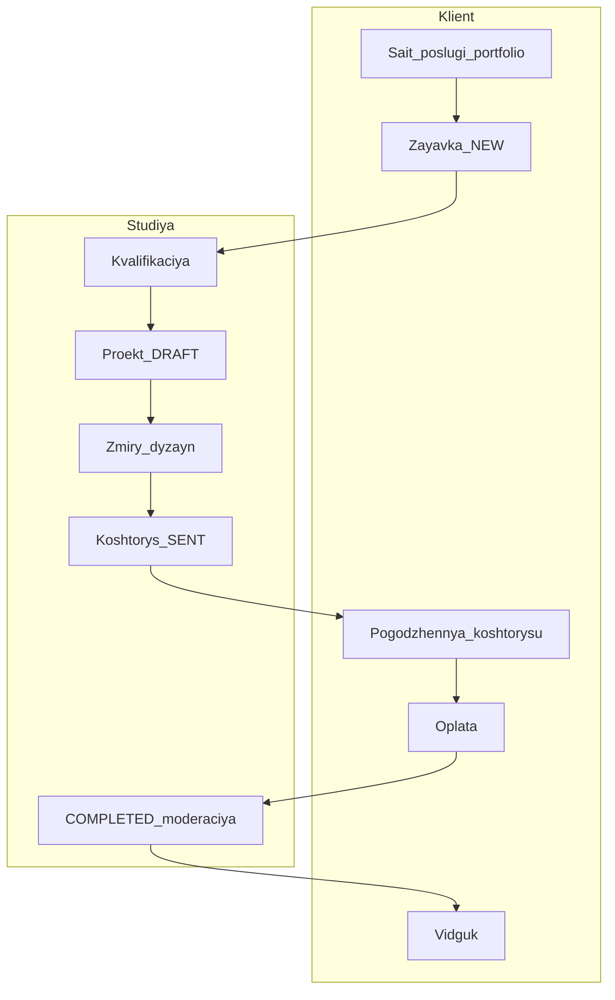
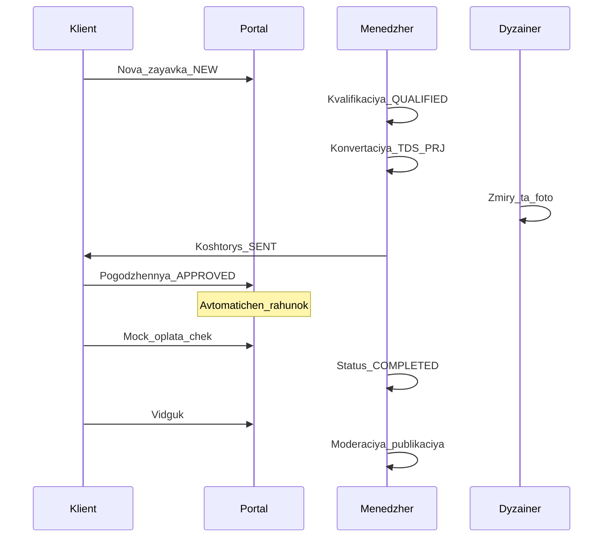

# Бізнес-логіка INTERIORIX

## 1. Ролі в системі

У поточній версії продукту **чотири робочі ролі** плюс **клієнт**. Окремих облікових записів «кошторисник» або «бухгалтер» у демо немає — їхні типові функції виконує **менеджер проєкту**.

| Роль | Де працює | Головні обов’язки |
|------|-----------|-------------------|
| **Клієнт** | Клієнтський портал | Подає заявку, переглядає проєкт, погоджує кошторис, оплачує рахунок, зберігає чеки, залишає відгук |
| **Менеджер проєкту** | Робочий простір (workspace) | Обробляє заявки, створює проєкт, веде кошторис і статуси, контролює оплати та чеки, модерує відгуки |
| **Дизайнер** | Робочий простір | «Моя робота», заміри, фото-звіти, редагування каталогу послуг і портфоліо |
| **Адміністратор** | Робочий простір | Усе, що менеджер, плюс керування користувачами та повний доступ до налаштувань |

### Що може / не може (стисло)

| Дія | Клієнт | Менеджер | Дизайнер | Адмін |
|-----|:------:|:--------:|:--------:|:-----:|
| Створити заявку | ✓ | — | — | — |
| Кваліфікувати / конвертувати заявку в проєкт | — | ✓ | — | ✓ |
| Закріпити заявку за собою | — | ✓ | ✓ | ✓ |
| Змінювати статус проєкту | — | ✓ | — | ✓ |
| Заміри та фото-звіти | — | ✓ | ✓ | ✓ |
| Кошторис: створити, надіслати клієнту | — | ✓ | — | ✓ |
| Погодити / відхилити кошторис | ✓ | — | — | — |
| Оплатити рахунок (демо) | ✓ | ✓* | — | ✓* |
| Модерувати відгуки на сайті | — | ✓ | — | ✓ |
| Користувачі системи | — | — | — | ✓ |

\* Менеджер і адмін можуть проводити тестову оплату з робочого простору; клієнт — з порталу.

---

## 2. Ключові сутності

Усі «справи» в системі прив’язані до людей і кодів, щоб їх легко знайти в листуванні та звітах.

| Сутність | Код (приклад) | Зміст |
|----------|---------------|--------|
| **Заявка** | `TDS-LEAD-37470094` | Перше звернення клієнта: опис задачі, бюджет, адреса, послуга |
| **Проєкт** | `TDS-PRJ-15` | Робочий об’єкт студії після прийняття заявки: команда, етапи, заміри |
| **Кошторис** | версія 1, 2, … | Розрахунок вартості робіт і матеріалів; клієнт погоджує або відхиляє |
| **Рахунок** | `TDS-PRJ-15-INV-MAIN` | Сума до оплати після погодження кошторису |
| **Платіж** | запис у системі | Факт оплати (у демо — тестова «карткова» оплата) |
| **Чек** | `RCPT-2026-764780` | PDF-підтвердження оплати; можна перевірити публічно за номером |
| **Відгук** | після завершення | Оцінка та текст від клієнта; публікується після модерації |

---

## 3. Загальна схема процесу

---

## 4. Повний бізнес-процес покроково

### Фаза A — Залучення клієнта

| Крок | Хто | Що відбувається | Статус заявки |
|------|-----|-----------------|---------------|
| 1 | Клієнт (гість) | Переглядає головну, каталог послуг, портфоліо на публічному сайті | — |
| 2 | Клієнт | Натискає «Створити заявку» → вхід або реєстрація | — |
| 3 | Клієнт | Заповнює форму «Нова заявка»: послуга, опис, адреса, бюджет, фото-референси | **Нова** (`NEW`) |

Після кроку 3 заявка потрапляє до менеджера в розділ «Заявки» робочого простору.

### Фаза B — Обробка студією

| Крок | Хто | Що відбувається | Статус заявки / проєкту |
|------|-----|-----------------|-------------------------|
| 4 | Менеджер | Переглядає заявку, уточнює дані, переводить у кваліфіковану | **Кваліфікована** (`QUALIFIED`) |
| 5 | Менеджер | Конвертує заявку в проєкт — з’являється код `TDS-PRJ-…` | **Конвертована** (`CONVERTED`) |
| 6 | Менеджер | Призначає менеджера та дизайнера на картці проєкту | Проєкт: **Чернетка** (`DRAFT`) |
| 7 | Дизайнер | Може «закріпити» заявку або працювати з «Моя робота» | — |
| 8 | Дизайнер / менеджер | Вносить **заміри** об’єкта, завантажує **фото-звіти** | — |
| 9 | Менеджер | Переводить проєкт по етапах (див. таблицю статусів нижче) | `ESTIMATION` → `DESIGN` → … |

**Важливо:** на етапі конвертації **рахунок ще не створюється** — лише проєкт і команда.

### Фаза C — Кошторис і гроші

| Крок | Хто | Що відбувається | Статус |
|------|-----|-----------------|--------|
| 10 | Менеджер | Створює кошторис, додає позиції (роботи, матеріали), проходить внутрішні етапи | Чернетка → **Надіслано клієнту** (`SENT`) |
| 11 | Клієнт | У порталі бачить кошторис, **погоджує** або **відхиляє** | **Погоджено** / **Відхилено** |
| 12 | Система | Після погодження автоматично створюється **рахунок** до оплати | Рахунок: **Надіслано** |
| 13 | Клієнт | У розділі «Рахунки» проходить **тестову оплату** (демо-картка) | Платіж: **Оплачено** |
| 14 | Система / менеджер | Формується **чек PDF**; номер чека можна перевірити на публічній сторінці `/verify/…` | Чек: **Видано** |

У навчальному (демо) режимі оплата не підключена до реального банку — це імітація для показу повного циклу.

### Фаза D — Завершення і репутація

| Крок | Хто | Що відбувається | Статус |
|------|-----|-----------------|--------|
| 15 | Менеджер | Переводить проєкт у **Завершено** (`COMPLETED`) | Проєкт завершений |
| 16 | Клієнт | Залишає **відгук** (оцінка, текст, фото) | **Очікує модерації** |
| 17 | Менеджер / адмін | Публікує або приховує відгук | **Опубліковано** / приховано |
| 18 | Відвідувач сайту | Бачить відгук на публічній сторінці «Відгуки» | — |
| 19 (опційно) | Менеджер | Може перевести проєкт у **Гарантія** (`WARRANTY`) | Післягарантійний облік |

---

## 5. Статуси (для опису в записки)

### Заявка

| Код | Українська назва | Зміст для клієнта | Зміст для студії |
|-----|------------------|-------------------|------------------|
| `NEW` | Нова | Заявку надіслано, очікуйте відповіді | Потрібна первинна обробка |
| `QUALIFIED` | Кваліфікована | Заявку прийнято в роботу | Можна конвертувати в проєкт |
| `CONVERTED` | Конвертована | Створено ваш проєкт | Заявка закрита, робота в проєкті |
| `REJECTED` | Відхилена | Заявку не продовжено | Відмова з фіксацією в системі |

### Проєкт (етапи життєвого циклу)

| Код | Українська назва | Типовий зміст |
|-----|------------------|---------------|
| `DRAFT` | Чернетка | Проєкт створено, команда призначається |
| `ESTIMATION` | Кошторис | Підготовка розрахунку вартості |
| `DESIGN` | Дизайн | Розробка дизайн-рішень, заміри |
| `APPROVED` | Погоджено | Клієнт погодив напрям / кошторис |
| `IN_PROGRESS` | У роботі | Реалізація на об’єкті |
| `PAUSED` | На паузі | Тимчасова зупинка |
| `COMPLETED` | Завершено | Роботи завершені; можна лишити відгук |
| `WARRANTY` | Гарантія | Післязавершний період |
| `CANCELLED` | Скасовано | Проєкт закрито без виконання |

**Дозволені переходи** (спрощено): з чернетки — у кошторис або скасування; з «У роботі» — у «Завершено» або паузу; з «Завершено» — лише в «Гарантія». Повний граф переходів зафіксований у правилах системи (стан-машина проєкту).

### Кошторис

| Код | Українська назва |
|-----|------------------|
| `DRAFT` | Чернетка |
| `PRICING` | Розрахунок |
| `PENDING_REVIEW` | На внутрішній перевірці |
| `SENT` | Надіслано клієнту |
| `APPROVED` | Погоджено клієнтом |
| `REJECTED` | Відхилено клієнтом |

### Рахунок, платіж, чек, відгук

| Сутність | Основні статуси |
|----------|-----------------|
| Рахунок | Надіслано → Оплачено (або прострочено / скасовано) |
| Платіж | Очікує оплати → Оплачено |
| Чек | Видано |
| Відгук клієнта | Очікує модерації → Опубліковано (або приховано) |

---

## 6. Фінансовий контур (простими словами)

1. **Коли з’являється рахунок** — після того, як клієнт у порталі натискає «Погодити» на кошторисі. До цього моменту клієнт бачить лише пропозицію ціни, а не рахунок до оплати.

2. **Оплата в демо** — імітація банківської картки (навчальний режим). У записку можна описати як «модуль інтеграції з платіжним шлюзом зарезервовано, реалізовано mock для демонстрації».

3. **Чек** — PDF-документ з номером, сумою, проєктом; клієнт зберігає в порталі, менеджер — у робочому просторі.

4. **Публічна перевірка** — будь-хто може ввести номер чека на сайті (`/verify/…`) і переконатися, що чек видано системою (прозорість для замовника).

5. **Бюджет проєкту** — після погодження кошторису в картці проєкту може з’явитися затверджений бюджет (`budgetApproved`), узгоджений із сумою кошторису.

---

## 7. Альтернативні сценарії

| Ситуація | Результат |
|----------|-----------|
| Менеджер відхиляє заявку | Статус **Відхилена**, проєкт не створюється |
| Клієнт скасовує заявку (поки не конвертована) | Заявка закривається без проєкту |
| Клієнт відхиляє кошторис | Потрібна нова версія кошторису від менеджера |
| Проєкт на паузі | Роботи зупинені, статус **На паузі**, можна повернути в роботу або дизайн |
| Проєкт скасовано | Подальші оплати та етапи не ведуться |

---

## 8. Сповіщення та прозорість

Система надсилає **сповіщення** клієнту та співробітникам (зміна статусу заявки, кошторис надіслано, оплата, тощо). Це зменшує кількість дзвінків «на якому ми етапі?» — відповідь видно в порталі та в центрі сповіщень.

**Журнал дій** (audit) у робочому просторі фіксує, хто і коли змінив статус, створив кошторис, провів оплату — для підзвітності всередині студії.

---

Пов’язаний матеріал: [02-storinky-ta-kontury.md](./02-storinky-ta-kontury.md) (де це видно на екрані), [03-tehnologiyi.md](./03-tehnologiyi.md) (як це реалізовано технічно).
