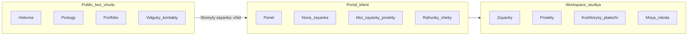

# Сторінки та контури системи

Система поділена на **три контури** — три різні «зони» одного сайту. Кожна має свою аудиторію та меню.

| Контур | URL (початок) | Хто заходить | Призначення |
|--------|---------------|--------------|-------------|
| **Public** | `/` | Будь-хто в інтернеті | Презентація студії, каталог, портфоліо, контакти |
| **Portal** | `/portal/…` | Клієнт після входу | Заявки, проєкти, рахунки, чеки, відгуки |
| **Workspace** | `/workspace/…` | Менеджер, дизайнер, адмін | Внутрішня робота студії |

Клієнт **не бачить** робочий простір. Співробітники **не працюють** в клієнтському порталі (окрім тестування під клієнтським акаунтом).

---

## Public — публічний сайт

Доступ без пароля. Головна ціль — зацікавити та направити до заявки.

| Сторінка | URL | Призначення |
|----------|-----|-------------|
| Головна | `/` | Презентація: інтер’єр, екстер’єр, керування проєктом; кнопка «Створити заявку» |
| Послуги | `/services` | Каталог пакетів послуг |
| Деталі послуги | `/services/:slug` | Опис пакета, ціна, кнопка замовлення |
| Портфоліо | `/portfolio` | Кейси виконаних робіт |
| Кейс портфоліо | `/portfolio/:slug` | Деталі проєкту; «Хочу подібний проєкт» |
| Відгуки | `/reviews` | Опубліковані відгуки клієнтів |
| Команда | `/team` | Презентація спеціалістів |
| Контакти | `/contact` | Зворотний зв’язок |
| Вхід | `/login` | Вхід у кабінет (клієнт або співробітник) |
| Реєстрація | `/register` | Створення акаунта клієнта |
| Перевірка чека | `/verify/:number` | Публічна перевірка справжності чека |

**Створити заявку:** з головної або хедера → спочатку **вхід** (або реєстрація), потім форма **Нова заявка** в порталі.

---

## Portal — клієнтський портал

Після входу клієнт бачить бічне меню «Портал».

| Пункт меню | URL | Призначення |
|------------|-----|-------------|
| Нова заявка | `/portal/orders/new` | Форма нової заявки: послуга, опис, адреса, бюджет, референси |
| Панель | `/portal/dashboard` | Зведення: заявки, проєкти, події |
| Мої заявки | `/portal/orders` | Список заявок і їх статусів |
| Деталі заявки | `/portal/orders/:code` | Одна заявка: статус, опис, зв’язок з проєктом |
| Мої проєкти | `/portal/projects` | Список проєктів клієнта |
| Деталі проєкту | `/portal/projects/:code` | Етап, кошториси, фото, оплати |
| Рахунки | `/portal/invoices` | Рахунки до оплати та історія |
| Оплата рахунку | `/portal/invoices/pay` | Тестова сторінка оплати (демо) |
| Чеки | `/portal/receipts` | Перегляд і завантаження чеків |
| Відгуки | `/portal/reviews` | Написати відгук після завершення проєкту |
| Сповіщення | `/portal/notifications` | Повідомлення про зміни |
| Профіль | `/portal/profile` | Ім’я, контакти, пароль |

---

## Workspace — робочий простір студії

Після входу співробітник бачить меню залежно від **ролі**. Нижче — хто бачить який пункт.

| Пункт меню | URL | ADMIN | Менеджер | Дизайнер |
|------------|-----|:-----:|:--------:|:--------:|
| Огляд | `/workspace/dashboard` | ✓ | ✓ | — |
| Моя робота | `/workspace/my-work` | — | — | ✓ |
| Сповіщення | `/workspace/notifications` | ✓ | ✓ | ✓ |
| Аналітика | `/workspace/analytics` | ✓ | ✓ | — |
| Звіти | `/workspace/reports` | ✓ | ✓ | — |
| Заявки | `/workspace/orders` | ✓ | ✓ | ✓ |
| Деталі заявки | `/workspace/orders/:code` | ✓ | ✓ | ✓ |
| Проєкти | `/workspace/projects` | ✓ | ✓ | ✓ |
| Картка проєкту | `/workspace/projects/:id` | ✓ | ✓ | ✓ |
| Каталог послуг | `/workspace/services` | ✓ | — | ✓ |
| Портфоліо (редактор) | `/workspace/portfolio` | ✓ | — | ✓ |
| Кошториси | `/workspace/estimates` | ✓ | ✓ | — |
| Заміри | `/workspace/measurements` | ✓ | ✓ | ✓ |
| Платежі | `/workspace/payments` | ✓ | ✓ | — |
| Чеки | `/workspace/receipts` | ✓ | ✓ | — |
| Профіль | `/workspace/profile` | ✓ | ✓ | ✓ |
| Журнал дій | `/workspace/audit` | ✓ | ✓ | — |
| Відгуки (модерація) | `/workspace/reviews` | ✓ | ✓ | — |
| Користувачі | `/workspace/users` | ✓ | — | — |

### Типові маршрути роботи

- **Менеджер:** Заявки → кваліфікація → конвертація → Проєкт → Кошториси → Платежі / Чеки → Відгуки.
- **Дизайнер:** Моя робота → Проєкт (заміри, фото) → за потреби Каталог / Портфоліо.
- **Адмін:** те саме, що менеджер, плюс Користувачі та повний Огляд.

---

## Як контури пов’язані з бізнес-процесом

| Етап з [01-biznes-logika.md](./01-biznes-logika.md) | Де це в інтерфейсі |
|-----------------------------------------------------|-------------------|
| Клієнт дізнається про студію | Public: головна, послуги, портфоліо |
| Подає заявку | Portal: Нова заявка |
| Менеджер обробляє | Workspace: Заявки → Проєкт |
| Дизайнер робить заміри | Workspace: Проєкт / Моя робота |
| Кошторис і оплата | Workspace: Кошториси; Portal: рахунки, чеки |
| Відгук на сайті | Portal: Відгуки; Workspace: модерація; Public: /reviews |

---

## Примітка про старі адреси

Частина адрес робочого простору (`/workspace/kanban`, `/workspace/calendar`, `/workspace/map` тощо) **перенаправляє** на актуальні розділи (проєкти або огляд). У записку їх можна не описувати — у меню вони не показуються.

---

Далі: [03-tehnologiyi.md](./03-tehnologiyi.md) — з чого зроблена система технічно.
