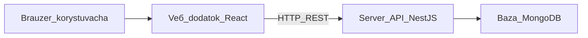

# Технології та архітектура (огляд для записки)

Цей розділ пояснює **з чого зібрана** система INTERIORIX, без глибокого занурення в код. Достатньо для розділів дипломної записки на кшталт «Програмні засоби», «Архітектура системи», «Реалізація».

---

## 1. Загальна схема



1. Користувач відкриває сайт у **браузері**.
2. **Веб-додаток** (інтерфейс) показує сторінки й надсилає запити на сервер.
3. **Сервер** перевіряє права, виконує бізнес-правила, читає й записує дані.
4. **База даних** зберігає заявки, проєкти, користувачів, платежі тощо.

У навчальному розгортанні все це запускається **локально** однією командою (Docker Compose) на комп’ютері розробника.

---

## 2. Стек технологій

| Шар | Технологія | Роль простими словами |
|-----|------------|----------------------|
| Мова | **TypeScript** | Єдина мова для клієнта й сервера; менше помилок завдяки типізації |
| Інтерфейс | **React 18** | Динамічні сторінки без перезавантаження всього сайту |
| Збірка UI | **Vite** | Швидка розробка та збірка веб-додатку |
| Стилі | **Tailwind CSS** | Оформлення, адаптивність |
| Маршрутизація | **React Router** | Public / Portal / Workspace — різні «зони» в одному додатку |
| Стан сесії | **Zustand** | Збереження входу (хто залогінений) у браузері |
| Сервер | **NestJS** (Node.js) | REST API, модулі за доменами: CRM, проєкти, кошториси, платежі |
| База даних | **MongoDB** + **Mongoose** | Документна БД: гнучкі записи заявок і проєктів |
| Авторизація | **JWT** + **bcrypt** | Токен після входу; паролі — у захешованому вигляді |
| PDF-чеки | **PDFKit** | Генерація чеків на сервері |
| Контейнери | **Docker Compose** | MongoDB + backend + frontend одним запуском |
| Репозиторій | **npm workspaces (monorepo)** | Один проєкт: `apps/backend`, `apps/frontend`, спільні пакети |

### Внутрішні пакети проєкту

| Пакет | Призначення |
|-------|-------------|
| `@tailored/shared` | Спільні підписи статусів, ролей, форматування дат і сум |
| `@tailored/ui` | Спільні компоненти інтерфейсу (меню, кнопки, картки) |

Це зменшує розбіжності між тим, що бачить користувач, і тим, що зберігає сервер.

---

## 3. Monorepo — одна кодова база

Проєкт організований як **монорепозиторій**:

```
INTERIORIX/   (репозиторій; технічна назва папки може відрізнятися)
├── apps/
│   ├── backend/     ← сервер API
│   └── frontend/    ← сайт у браузері
├── packages/
│   ├── shared/      ← спільна логіка підписів
│   └── ui/          ← спільний дизайн інтерфейсу
├── help/            ← цей гайд
├── docs/            ← технічна документація
└── docker-compose.yml
```

Перевага для опису в дипломі: **єдина версія** бізнес-правил (наприклад, назви статусів проєкту) для інтерфейсу й сервера.

---

## 4. Безпека та ролі (коротко)

- Після входу сервер видає **JWT-токен**; без нього закриті розділи порталу й workspace недоступні.
- Кожен запит до API перевіряється на **роль** (клієнт, менеджер, дизайнер, адмін).
- На інтерфейсі **додатково** приховуються пункти меню, які роль не повинна бачити (наприклад, дизайнер не бачить «Кошториси»).

---

## 5. Що не є основою поточного запуску

У репозиторії залишилась **схема Prisma** під PostgreSQL — це слід раннього варіанту або паралельного прототипу. У **поточному демо** дані живуть у **MongoDB**; сідування — скрипт `npm run seed`, а не SQL-міграції.

У записку коректно писати: *«Персистентний шар реалізовано на MongoDB; реляційна схема в репозиторії не використовується в експлуатаційному контурі.»*

---

## 6. Готовий абзац для вставки в записку (українською)

> Інформаційну систему **INTERIORIX** реалізовано як **клієнт–серверний веб-застосунок** у складі **монорепозиторію** на мові **TypeScript**. Користувацький інтерфейс побудовано на **React** із збірником **Vite** та стилізацією **Tailwind CSS**; серверну частину реалізовано на платформі **NestJS**, що надає **REST API** для бізнес-операцій (заявки, проєкти, кошториси, платежі, відгуки). Дані зберігаються в документній СУБД **MongoDB**. Доступ розмежовано за ролями з використанням **JWT** та хешування паролів (**bcrypt**). Спільні елементи інтерфейсу та доменні підписи винесено в окремі пакети **shared** та **ui**. Розгортання навчальної версії виконується контейнеризацією **Docker Compose** (база даних, API-сервер, статичний frontend).

---

## 7. Зв’язок технологій із бізнес-логікою

| Бізнес-вимога | Як підтримано технічно |
|---------------|-------------------------|
| Три аудиторії (сайт, клієнт, студія) | Один frontend, різні маршрути та меню |
| Різні права | Ролі на API + фільтр меню |
| Ланцюжок заявка → проєкт | Окремі сутності в БД + CRM-сервіс |
| Кошторис → рахунок | Подія «погоджено» запускає створення рахунку |
| Чек і перевірка | PDF на сервері + публічна сторінка verify |
| Статуси проєкту | Правила переходів (стан-машина) на сервері |

---

Повернутися до змісту: [README.md](./README.md) · Бізнес-процес: [01-biznes-logika.md](./01-biznes-logika.md) · Сторінки: [02-storinky-ta-kontury.md](./02-storinky-ta-kontury.md)
