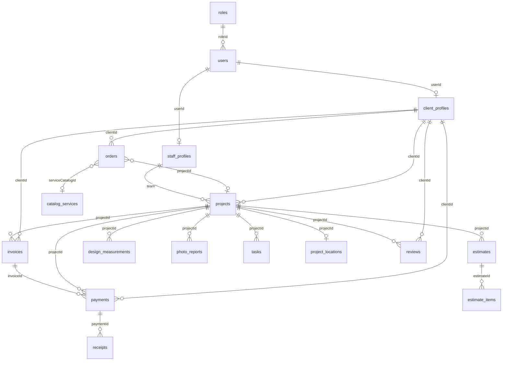

# Модель даних MongoDB — діаграми для дипломної

У **MongoDB** дані зберігаються в **колекціях** (аналог таблиць). Зв’язки — через **`ObjectId`**. У записку це оформлюють **як ER-діаграмму** з прямокутниками, полями, PK/FK і лініями — так само, як у прикладі з PostgreSQL (Luxury Resort), тільки в підписі вказують MongoDB.

**Джерело правди:** `apps/backend/src/mongo/schemas/*.ts`  
**Готовий файл для діаграмми:** [`tds-database.dbml`](./tds-database.dbml)

> Склад, SKU, постачальники, quality checklists **не входять** у модель для диплому.

---

## Як отримати картинку як на прикладі (рекомендовано)

### dbdiagram.io — усі поля, як у прикладі Luxury Resort

1. Відкрийте https://dbdiagram.io/d  
2. **Import** → файл **`help/tds-database.dbml`** (усі **27 колекцій**, **кожне поле** з коду).  
3. У правій панелі: **Theme** → світла тема; **Layout** — розставте групами (auth зліва, crm центр, finance справа).  
4. **Export → PNG / PDF** (краще PDF для A3 альбомної — вміщається компактніше).  
5. Підпис під рисунком: *«Рис. X — Логічна ER-модель даних ІС INTERIORIX (MongoDB)»*

**Чому не Mermaid:** dbdiagram показує **кожну колонку з типом і PK/FK** — як на вашому прикладі; Mermaid лише назви сутностей.

**Абзац для тексту записки:**

> *«Логічна модель даних подана у вигляді entity-relationship діаграмми. Фізичне схранилище — документна СУБД MongoDB; зв’язки між сутностями реалізовані полями типу ObjectId та забезпечуються рівнем застосунку (NestJS, Mongoose).»*

---

## Альтернатива — Mermaid (лише зв’язки, без усіх полів)

Якщо потрібна **спрощена** схема без колонок — розділ 2 нижче. **Для диплому використовуйте dbdiagram.**

## 1. Перелік колекцій (27)

| № | Колекція | Призначення |
|---|----------|-------------|
| 1 | `roles` | Ролі |
| 2 | `users` | Облікові записи |
| 3 | `client_profiles` | Профіль клієнта |
| 4 | `staff_profiles` | Профіль співробітника |
| 5 | `uploaded_files` | Файли |
| 6 | `orders` | Заявки |
| 7 | `projects` | Проєкти |
| 8 | `project_locations` | Адреса проєкту |
| 9 | `catalog_services` | Каталог послуг |
| 10 | `portfolio_items` | Портфоліо |
| 11 | `estimates` | Кошториси |
| 12 | `estimate_items` | Позиції кошторису |
| 13 | `invoices` | Рахунки |
| 14 | `payments` | Платежі |
| 15 | `receipts` | Чеки |
| 16 | `design_measurements` | Заміри |
| 17 | `photo_reports` | Фото / дизайн |
| 18 | `tasks` | Задачі |
| 19 | `task_comments` | Коментарі |
| 20 | `teams` | Бригади |
| 21 | `team_members` | Склад бригади |
| 22 | `change_requests` | Запити на зміни |
| 23 | `reviews` | Відгуки |
| 24 | `notifications` | Сповіщення |
| 25 | `audit_logs` | Журнал дій |
| 26 | `approvals` | Погодження кошторису |
| 27 | `contact_submissions` | Контакти з сайту |

---

## 2. Оглядова діаграма (Mermaid)



---

## 3. Головний ланцюжок (для тексту)

```
users → client_profiles → orders → projects → estimates → estimate_items
                                              → invoices → payments → receipts
                                              → photo_reports / tasks / reviews
```

---

## Поради для оформлення як у прикладі

| Елемент прикладу | У INTERIORIX |
|------------------|--------|
| `public.users` | колекція `users` (група **auth** у dbdiagram) |
| `uuid` + PK | `ObjectId` + `[pk]` |
| FK стрілки | `ref: >` у dbml |
| Назва проєкту внизу | Підпис: *INTERIORIX*, *Розробник*, *Група* — у Word |

Якщо **27 таблиць** на одному аркуші дрібно — зробіть **2 рисунки**: (1) auth + public_content + crm, (2) finance + operations + engagement. Групи вже розбиті в `tds-database.dbml`.

---

*Файл `tds-database.dbml` оновлюйте разом ізі schemas.*
